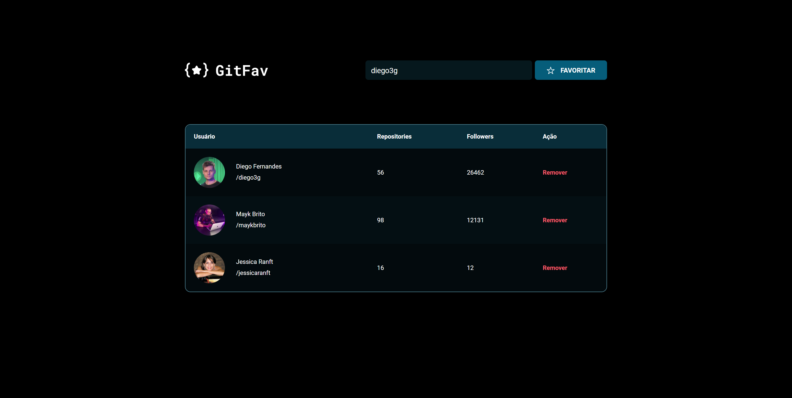

# Explorer - Stage 06: GitFav

> GitFav

## Description
This challenge consisted on creating a web page where the user can save their favorite Github users.

The user can insert the username in the text input, and then click the "favoritar" ("favorite" in Portuguese) button.

After that, the favorite username appears on the list with their image, name, number of repositories, and number of followers.

If they want to remove the user from the list, they need to click on "Remover".

[Click to view it live!](https://explorer-stage06-git-fav-one.vercel.app/)

## Other features:
- The app gets the data from Github API, and save it on the browser's Local Storage.

- The languages used were `HTML5` `CSS3` and `JavaScript`

## The purpose was to study:

- HTML tables
- JS classes and inheritance
- JS data management
- JS error management with try, catch and throw
- JS async functions

## Software

VSCode
